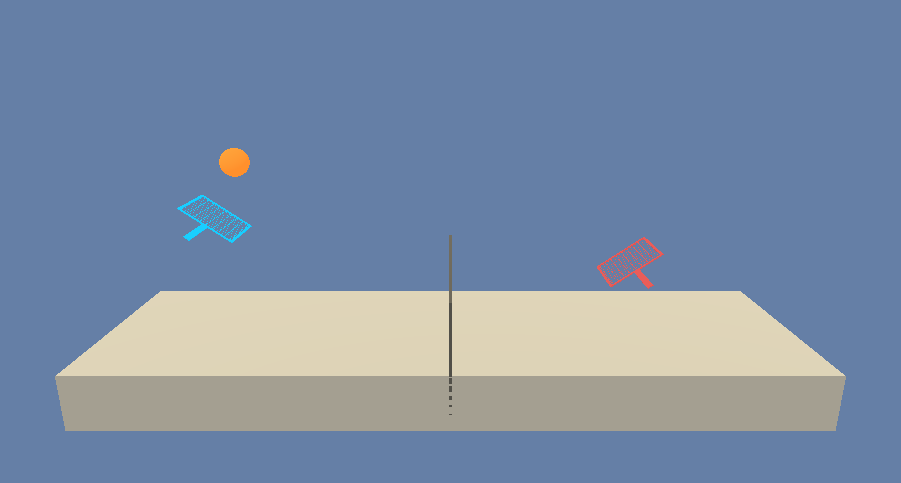
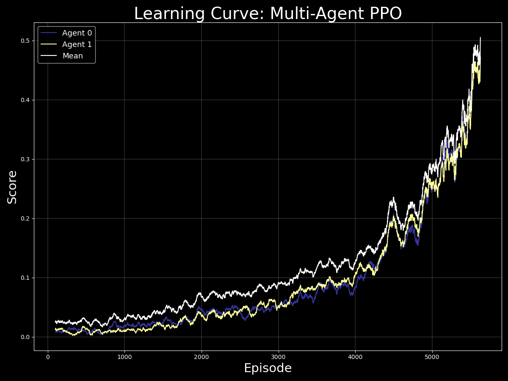

# Competitive Reinforcement Learning through Multi-Agent Proximal Policy Optimization

The chance to evaluate one's capabilities in the pursuit of achievement through competition is a beautiful thing.  Who doesn't relish the opportunity to take on a few friends in a fair game from time to time?  I myself particularly enjoy the challenge of a one-on-one basketball game, taking a stroll down memory lane by attempting to beat an old Nintendo 64 game, or even having a board game night with good company.  The process of continually improving performance over time is complex and enjoyable.  And it is achieved via the process of repitition, evaluation, and using subsequent insights to implement changes in approach.

Well, what if this process could be implemented through Artificial Intelligence?  Could experience, evaluation, and policy optimization be used in order to train an agent to become otherworldy in a specific competitive domain?  This repository contains an implementation of an AI algorithm used in this exact pursuit.

## Details

The above implementation utilizes a Multi-Agent Proximal Policy Optimization (MAPPO) algorithm in order to develop the expertise of agents in playing tennis!  This algorithm may be used in a variety of domains and is effective in its ability to produce an optimal methodology for realizing maximum reward.

The approach utilizes the power of Actor-Critic networks in order to optimize a policy and achieve expertise in a predefined domain.  Starting the process knowing nothing about what actions would lead to a positive or negative result, the algorithm initially samples and evaluates actions selected from an unoptimized Gaussian distribution.  After many iterations, the Critic network effectively evaluates each action result and provides meaningful information to the Actor so that it may optimize its action sampling distribution leading to better gameplay!

In the environment, the state space consists of `8` variables that correspond to the position and velocity of the ball and the racket.  The action space consists of `2` continuous actions of moving toward or away from the net and jumping.  A reward of `+0.1` is gained each time an agent is able to hit the ball over the net.  If the agent allows the ball to touch the ground or if the agent hits the ball out of bounds, it receives a reward of `-0.01`.  This score allocation approach promotes the overall objective of keeping the ball in play.  The environment is considered solved once the mean maximum episodic reward reaches `+0.5` for the past 100 episodes.

 

  

 

## Results
In the `saved_files` directory, you may find the saved model weights and learning curve plots for the successful Actor-Critic networks.  The trained agents were able to solve the environment within 6,000 episodes utilizing the MAPPO training algorithm.  The graph below depicts the agents' performance over time in terms of relative score averaged over the past 100 episodes.

 

  

 

## Dependencies
In order to run the above code, you will have to set up and activate a customized Python 3.6 environment.  You may follow the directions [here](https://github.com/udacity/deep-reinforcement-learning#dependencies) for setup instructions.

Next, click the link corresponding to your operating system below which will download the respective UnityEnvironment.  You may then save the resulting file directly inside of your cloned repository in order to run the code.
* [Linux](https://s3-us-west-1.amazonaws.com/udacity-drlnd/P3/Tennis/Tennis_Linux.zip)
* [Mac OSX](https://s3-us-west-1.amazonaws.com/udacity-drlnd/P3/Tennis/Tennis.app.zip)
* [Windows (64-bit)](https://s3-us-west-1.amazonaws.com/udacity-drlnd/P3/Tennis/Tennis_Windows_x86_64.zip)

## Let's Play Tennis!
All of the relevant functionality and tools you will need in order to initialize and train the agents are available inside of this repository.  Please utilize the `run_tennis_main.py` file in order to run the training process.  If you would like to change any parameters to customize training, please update the relevant attributes in the function calls below the `if __name__ == '__main__':` block.
